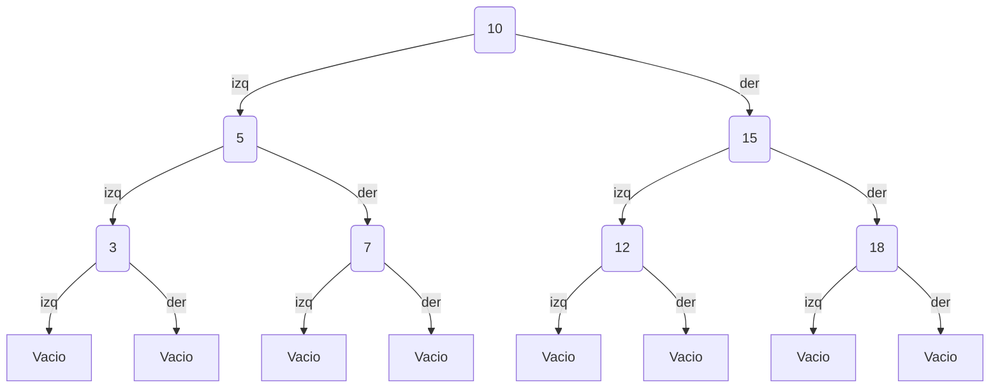
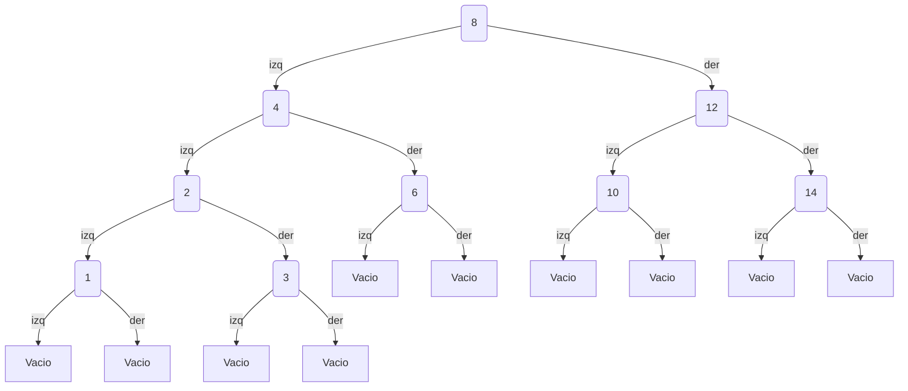
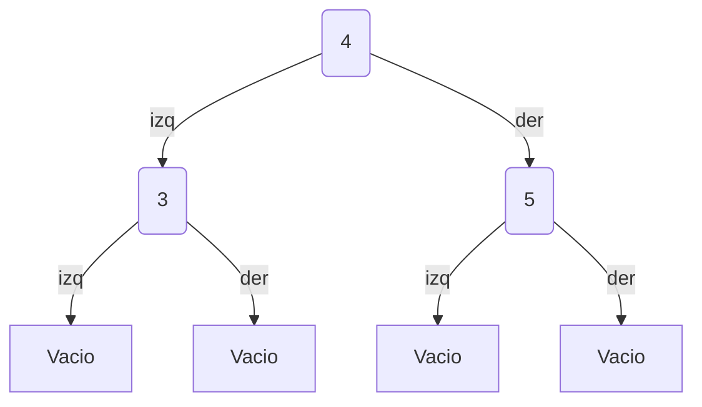
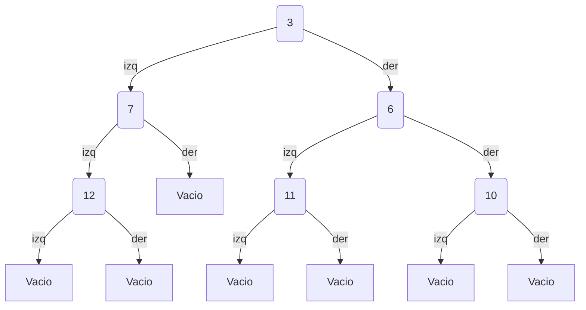
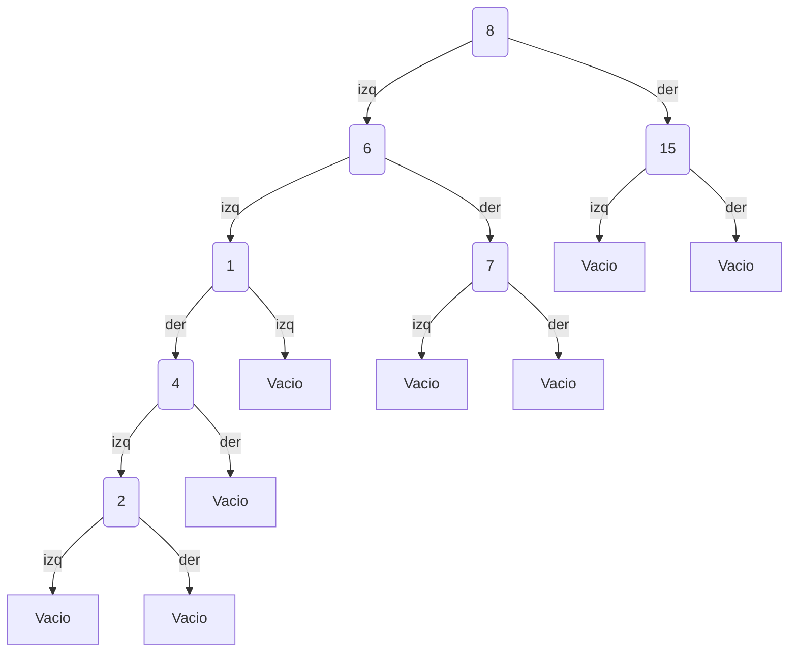

1. Objetivo de la práctica:
   
    El objetivo de la práctica es implementar diversas funciones a árboles en Haskell.

2. Tiempo requerido para la práctica:
   
    Calculo que me tomó de tres a cuatro horas (en lo que cenaba o me distraía jsjsj).

3. Comentarios y problemas encontrados:

    Las funciones auxiliares para listaArbol me causaban ambiguedad porque definí el tipo de dato Arbol en los dos archivos, pero luego ya lo pasé todo al Auxiliar y ya salió.

4. 1. Basándote en el tipo de dato Arbol construye las representaciones gráficas de dos árboles binarios, cada árbol debe tener entre 3 y 5 niveles. Estas representaciones debes adjuntarlas en tu respectivo README.md usando la sintaxis para generar árboles de la herramienta Mermaid.

Árbol 1:

Árbol 2:

4. 2. Crear la representación visual de los siguientes árboles:

a) AB 4 Vacio (AB 3 Vacio (AB 5 Vacio Vacio))

b) AB 3 (AB 7 (AB 12 Vacio Vacio) Vacio) (AB 6 (AB 11 Vacio Vacio) (AB
10 Vacio Vacio))

c) AB 8 (AB 6 (AB 1 Vacio (AB 4 (AB 2 Vacio Vacio) Vacio)) (AB 7 Vacio
Vacio)) (AB 15 Vacio Vacio)

5. Consulta arbolesHaskell_6 nota.hs de nuestro repositorio oficial y responde a las siguientes preguntas:

• De acuerdo al ejemplo de la función foldl o foldr el árbol resultante es un BST balanceado?
El árbol que se obtiene con foldr o foldl cumple con la propiedad de BST, porque la función de inserción mantiene el orden correcto de los elementos, pero no necesariamente queda balanceado porque eso depende del orden en que estén los datos en la lista. Por eso, en algunos casos, el árbol puede terminar completamente inclinado hacia un lado.

• De manera conceptual, ¿cuál seria la idea para que foldr o foldl nos ayude a insertar BST balanceados?
Las funciones foldr y foldl no son suficientes para balancear, ya que el balance depende del orden de inserción.
Para que el árbol quede balanceado habría que acomodar los datos antes, ordenándolos o construyendo el árbol a partir del elemento medio de forma recursiva para que el fold solo sea el mecanismo de inserción. Pero el balance vendría de preparar los datos.

• ¿Cúales son las ventajas que tienen las funciones foldl sobre foldr?
La función foldl usa menos memoria cuando se usa de forma estricta, porque evita acumular demasiadas evaluaciones pendientes, y por eso es mejor para acumuladores, sumas o conteos.

• ¿Cúales son las ventajas que tienen las funciones foldr sobre foldl?
La función foldr preserva la recursión natural de las listas, y por eso puede trabajar con listas infinitas. Por ello es útil con estructuras recursivas como árboles.

6. Capturas del GHCI:

   Terminal tras git log.
   ![Captura_terminal_practica6.png]
  